# Agentic-Customersupportflow

A SvelteKit + FastAPI support-ops demo for handling customer returns, enquiries, analytics, and AI-assisted marketing workflows.

## What It Does

- Customer support dashboard with queue, ticket creation, and enquiry review flows
- Enquiry analysis that classifies messages, drafts replies, and validates against Snowflake procedure output
- Return workflow with AI-assisted triage and response drafting
- Instagram post generation workflow with crewAI, Snowflake lookup, and OpenAI image generation
- Analytics dashboard backed by backend data

## Tech Stack

- Frontend: SvelteKit
- Backend: FastAPI
- Database: Snowflake
- AI/LLM: OpenAI via LiteLLM
- Agent workflows: LangGraph, crewAI

## Project Structure

- `src/` - SvelteKit frontend
- `backend/` - FastAPI backend
- `static/database/` - Snowflake SQL schema and procedure files
- `README.md` - project overview and setup

## Requirements

- Node.js 18+
- Python 3.11+
- Snowflake credentials
- OpenAI API key

## Setup

### 1. Install frontend dependencies

```bash
npm install
```

### 2. Install backend dependencies

```bash
cd backend
python -m venv .venv
.venv\Scripts\activate
pip install -r requirements.txt
```

### 3. Configure environment variables

Edit `backend/.env` with your local values.

Required variables:

- `SNOWFLAKE_ACCOUNT`
- `SNOWFLAKE_USERNAME`
- `SNOWFLAKE_PASSWORD`
- `SNOWFLAKE_DATABASE`
- `SNOWFLAKE_SCHEMA`
- `SNOWFLAKE_WAREHOUSE`
- `SNOWFLAKE_ROLE`
- `OPENAI_API_KEY`

Optional variables:

- `APP_ENV`
- `CORS_ORIGINS`
- `IMAGE_MODEL` - defaults to `gpt-image-2`
- `IMAGE_SIZE`

## Run Locally

### Backend

From `backend/`:

```bash
uvicorn app.main:app --reload
```

The API will be available at `http://localhost:8000` by default.

### Frontend

From the project root:

```bash
npm run dev
```

The app will usually run at `http://localhost:5173`.

## Deployment Links

The frontend is configured for Vercel deployment, and the backend should be deployed separately as a FastAPI service.

- Frontend: [https://agentic-customersupportflow.vercel.app](https://agentic-customersupportflow.vercel.app)
- Backend API: [https://agentic-customersupportflow.onrender.com](https://agentic-customersupportflow.onrender.com)
- Backend docs: [https://agentic-customersupportflow.onrender.com/docs](https://agentic-customersupportflow.onrender.com/docs)
- Backend health check: [https://agentic-customersupportflow.onrender.com/health](https://agentic-customersupportflow.onrender.com/health)
- Video Recording: [Video demo link](https://northeastern-my.sharepoint.com/:v:/g/personal/gangurde_a_northeastern_edu/IQA-Ko-FftDXSqe68uhJd4SJAbFrugrCqwcTag-_xpTeXk4?e=SCbGvc)
- Webpage Explainer: [https://agentic-customersupportflow.vercel.app/project-showcase](https://agentic-customersupportflow.vercel.app/project-showcase)

If you deploy the backend to a different host, update `PUBLIC_FASTAPI_URL` in your environment so the frontend points to the live API instead of `http://localhost:8000`.

## Main Workflows

### Dashboard

Shows summary analytics and overall support health.

### Architecture Flow

The architecture diagram below shows how the frontend, backend, Snowflake, and agent workflows connect across the project:

In short:

1. The user interacts with the SvelteKit frontend.
2. The frontend calls FastAPI routes for tickets, enquiries, analytics, and Instagram generation.
3. FastAPI reads and writes Snowflake data, and also coordinates agent workflows.
4. The agent workflows produce drafts, validations, summaries, and streamed outputs back to the UI.
5. The UI renders the result in the dashboard or showcase pages.

### Create Ticket

Handles return-ticket creation and related customer lookup workflows.

### Customer Enquiries

This is the main enquiry workflow:

1. Paste an email, chat transcript, or voicemail transcript
2. If the input is a voicemail, the frontend transcribes it to text first
3. Click `Analyze Enquiry`
4. The backend classifies the enquiry into one of seven supported categories
5. The matching Snowflake procedure is selected as the source of truth
6. The returned Snowflake data is used to ground the reply and validation checks
7. The UI shows the draft response, validation questions, and source rows for review

In practice, the enquiry workflow works like this:

1. The user gives an email, text message, or voicemail about a support issue.
2. Voicemail input is converted into text so the downstream LLM and Snowflake logic can work on one consistent format.
3. The response agent identifies the right enquiry category from the seven supported buckets.
4. The workflow calls the matching Snowflake procedure for that category and uses the returned data as the source of truth.
5. A draft reply is produced from the classified issue, customer context, and procedure output.
6. The frontend presents the draft, the supporting source rows, and any validation questions so the user can review before sending.



### Instagram Posts Creation

Uses the Instagram agentic pipeline to validate product data in Snowflake, summarize the campaign brief, generate content, iterate with critique, and produce a visual suggestion with OpenAI image generation.



### Create Return Ticket

The return workflow looks up the customer claim, pulls recent purchase and item metadata from Snowflake, runs the seven return guardrails through the researcher-policy loop, and returns a confidence-based assessment for approve, deny, or manual review.



## API Overview

Key endpoints used by the UI:

- `POST /api/enquiry/analyze`
- `POST /api/enquiry/create`
- `POST /api/enquiry/transcribe`
- `POST /api/instagram-posts/generate`
- `POST /api/instagram-posts/generate-stream`
- `POST /api/instagram-posts/generate-image`
- `GET /api/analytics/dashboard`
- `GET /api/customers`
- `GET /api/items`
- `POST /api/tickets/create`

## Snowflake Assets

The `static/database/` folder contains the SQL used to define the sample data model, including enquiry procedures and ticket schemas.

Important enquiry procedures:

- `ORDER_DELIVERY_PROCEDURE`
- `RETURNS_REFUNDS_PROCEDURE`
- `BILLING_PAYMENT_PROCEDURE`
- `ACCOUNT_MANAGEMENT_PROCEDURE`
- `GENERAL_ENQUIRY_PROCEDURE`

## Notes

- The voicemail flow now transcribes audio directly with OpenAI Whisper and does not depend on AWS or S3.
- Image generation now uses OpenAI's `gpt-image-2` model name in config and docs.
- The enquiry workflow is designed so Snowflake procedure output is the validation source of truth.

## License

See `LICENSE` for project licensing details.
